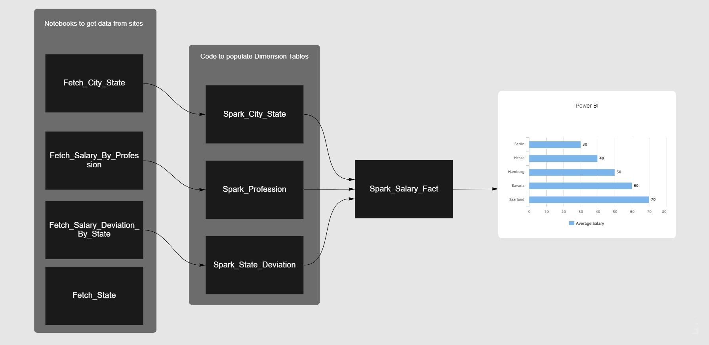
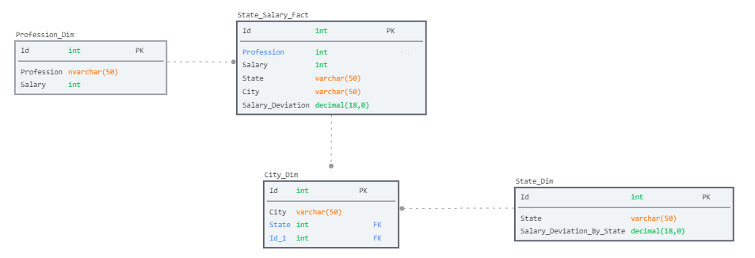
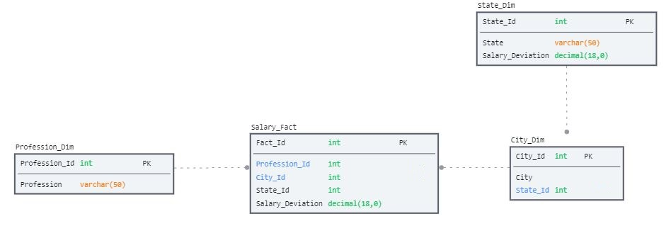

# Salary Analysis


---

### Table of Contents
- [Overview](#overview)
- [Program Flow](#program-flow)
- [Folder Structure](#folder-structure)
- [Program Execution](#program-execution)
- [Data Modeling](#data-modeling)
- [Tools](#tools)
- [Level Up](#level-up)


---

### Overview


- The purpose of doing this was to learn a bit about scraping data, modeling data, visualizing this data in Power BI.
- Fetched data from different sites of German Salaries based on Profession and the State.
- Also fetched the data of Cities, States and the Deviation of Salaries based on the States.
- After fetching this data, writing this data in CSV format.
- Transformated the data and writing them into respective folder so that it can be consumed.
- Profession, State, City are the tables and then based on these created a Salary_Fact_Table.


---

### Program Flow

<p align="center">
  
</p>

---


### Folder Structure
- Salary_Analysis
  - Fetch_City_State.ipynb
  - Fetch_Salary_By_Profession.ipynb
  - Fetch_Salary_Deviation_By_State.ipynb
  - Fetch_State.ipynb
  - Spark_City_State.ipynb
  - Spark_Profession.ipynb
  - Spark_State_Deviation.ipynb
  - Spark_Salary_Fact.ipynb
  - Fact (Folder)
  - Profession (Folder)
  - State (Folder)
  - State_Salary_Deviation (Folder)

- The **Fetch_*** will get data from sites and write in csv files.
- The **Spark_*** will read the csv files, tranform the data and write to respective folders.
- The folders will be created after you have executed the Spark code.

---

### Program Execution
- To get the data from websites, run all the files that have **Fetch** in them so that Profession, State, City, State_Salary_Deviation files get created
```bash
  ipython Fetch_City_State.ipynb
```
```bash
  ipython Fetch_Salary_By_Profession.ipynb
```
```bash
  ipython Fetch_Salary_Deviation_By_State.ipynb
```
```bash
  ipython Fetch_State.ipynb
```
- After we fetched this data now we will tranform it using Spark and write this to different folders.
```bash
  ipython Spark_City_State.ipynb
```
```bash
  ipython Spark_Profession.ipynb
```
```bash
  ipython Spark_State_Deviation.ipynb
```

- After having these csv files based on our data model we will create Dimensions and Fact and write to another folder. Spark_Salary_Fact will read all files and write them to Fact Folder.
```bash
  ipython Spark_Salary_Fact.ipynb
```
- Will get this csv file from Fact Folder and start to visualize this data in Power BI.

---


### Data Modeling

<p align="center">
  
</p>

- The above data model has 3 Dim and 1 Fact.
- We also are not using the Ids of different tables in our Fact Table as this data will not change but it is recommended to use Ids(Surogate Keys) as they are internal to the database or warehouse. 

#### Another Model

<p align="center">
  
</p>

-  In this model we are using the **Ids** of the Dim tables instead of the names which is a much better practice.
-  If we had more attributes of Dim table we could have moved to a more normalized model but for now denormalized it is.

---

### Tools

- Python, Pyspark
- VS Code
- Power BI
- Beautiful Soup
```bash
  pip install beautifulsoup4
```
- Requests
```bash
  pip install requests
```

---

### Level Up

- We could have created an ETL pipeline, if we had changing data, or some api that could have provided us with salary based on different factors e.g. inflation, cost of living etc. But as this data does not change much so having csv files would work in this case.
- We could get yearly data e.g. from the 2010 onwards and based on that get data till date. Will need to create an ETL pipeline and pull data, transform and load in files. The data models will also require some changes some will have to implement SCD, now based on our required it can be different and now having the historical and latest data we can get more insights.
