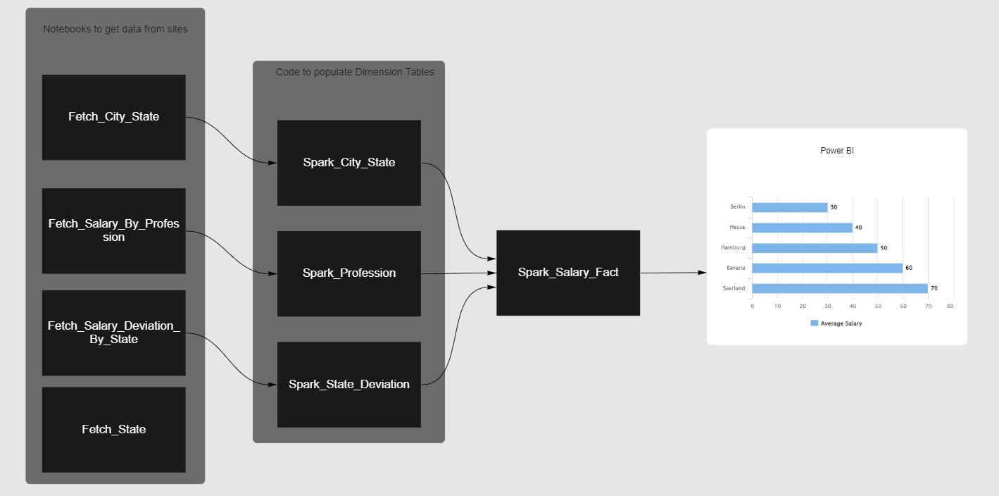

# Salary Analysis


### Overview

---

- The purpose of doing this was to learn a bit about scraping data, modeling data, visualizing this data in Power BI.
- Fetched data from different sites of German Salaries based on Profession and the State.
- Also fetched the data of Cities, States and the Deviation of Salaries based on the States.
- After fetching this data, writing this data in CSV format.
- After writing this data we do some cleaning, transformations and then write that into respective folder so that it can be consumed.
- Profession, State, City are the tables and then based on these created a Salary_Fact_Table


---

### Table of Contents
- [Program Flow](#program-flow)
- [Folder Structure](#folder-structure)
- [Program Execution](#program-execution)
- [Data Modeling](#data-modeling)
- [Tools](#tools)
- [Level Up](#level-up)


---

### Program Flow

<p align="center">
  
</p>

---


### Folder Structure
- Salary_Analysis
  - Fetch_City_State.ipynb
  - Fetch_Salary_By_Profession.ipynb
  - Fetch_Salary_Deviation_By_State.ipynb
  - Fetch_State.ipynb
  - Spark_City_State.ipynb
  - Spark_Profession.ipynb
  - Spark_State_Deviation.ipynb
  - Spark_Salary_Fact.ipynb
  - Fact (Folder)
  - Profession (Folder)
  - State (Folder)
  - State_Salary_Deviation (Folder)

- The ones starting with **Fetch** will get data from sites and write in a csv file.
- The ones with **Spark** will read the csv, tranform the data and write to respective folder.
- The folders will be created after you have executed the Spark code.

---

### Program Execution
- To scrape the data from websites, run all the files that have **Fetch** in them so that Profession, State, City, State_Salary_Deviation is fetched.
```bash
  ipython Fetch_City_State.ipynb
```
```bash
  ipython Fetch_Salary_By_Profession.ipynb
```
```bash
  ipython Fetch_Salary_Deviation_By_State.ipynb
```
```bash
  ipython Fetch_State.ipynb
```
- After we fetched this data and cleaned, tranformed it using Spark we will write this into different folder that will have different CSV files.
```bash
  ipython Spark_City_State.ipynb
```
```bash
  ipython Spark_Profession.ipynb
```
```bash
  ipython Spark_State_Deviation.ipynb
```

- After having these CSV files based on our model we will create Dimensions and Facts and write to another CSV. Spark_Salary_Fact will read all file and write them to Fact Folder.
```bash
  ipython Spark_Salary_Fact.ipynb
```
- Will get this CSV file and start to visualize this data in Power BI.

---


### Data Modeling

<p align="center">
  
</p>

- The above data model has 3 Dim and 1 Fact and using this Fact we create our visualiztion.
- This data model is not much normalized it depends the use case and what sort of database or warehouse you are using.
- Some warehouses take advantage of joining data, while others are not much performant.

#### Another Model

<p align="center">
  
</p>

-  In this model we are using the **Ids** of the Dim tables instead of the names which is a much better practice.
-  If we had more attributes of Dim table we could have moved to a more normalized model but for now denormalized it is.

---

### Tools

- Python, Pyspark
- VS Code
- Power BI
- Beautiful Soup
```bash
  pip install beautifulsoup4
```
- Requests
```bash
  pip install requests
```

---

### Level Up

- Used this model in visualization, mostly the data was denormalized it depends on the user how they want to create this data model, either in 3NF and having Surrogate keys and based on that or have a bit denormalized data if your data is not changing much.
- We could have created an ETL pipeline, if we had changing data, or some api that could have provided us with salary based on different factors e.g. Inflation, cost of living etc. But as the this data does not change much so one time csv files would work in this case.
- We could get yearly data e.g. from the 2010 onwards and based on that get data till date. Will need to create an ETL pipeline and pull data, transform and load in files. The data models will also require some changes some will have to implement SCD, now based on our required it can be different and now having the historical and latest data we can get more insights.
